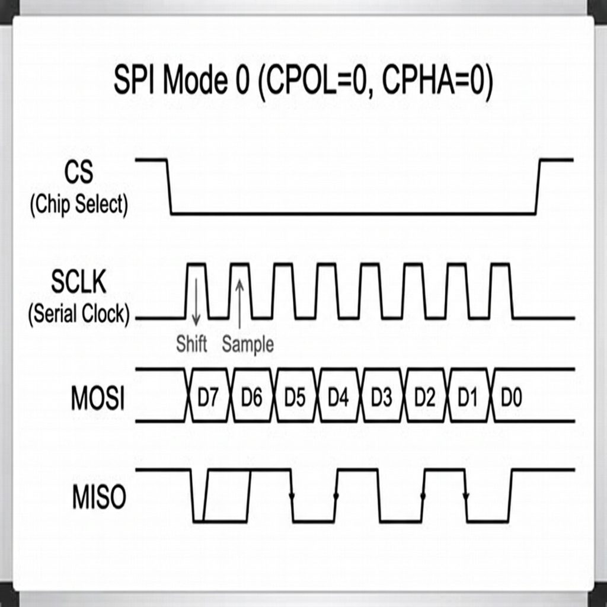

# 🎓 SPI Controller Interview & Revision Guide

This folder contains the complete, structured notes for revising the SPI Master-Slave project before an interview. 

---

## 1. Visualizing the Protocol (The Waveform)

If asked to draw or explain an SPI Mode 0 transaction, do not try to memorize a complex image. Follow the **4-Step Drawing Rule**:



### The 4-Step Drawing Rule (Say this out loud while drawing):
1. **The Frame:** "First, the master drops CS (Chip Select) to 0 to wake up the slave. It stays low for the whole transaction."
2. **The Clock:** "Because this is Mode 0 (CPOL=0), the clock idles at 0. During the transfer, the master generates 8 distinct clock pulses inside the CS window."
3. **The Setup (CPHA=0):** "Because CPHA=0, data is sampled on the *first* leading edge. This means both devices must put their first bit (Bit 7) on the wire the instant CS drops, *before* the first clock pulse happens."
4. **Sample & Shift:** "Both devices sample the data on the rising edge (↑). Both devices shift the next bit onto the wire on the falling edge (↓)."

> **Tip:** Make sure you draw MOSI and MISO changing state at exactly the same time. This proves you understand it is a **Full-Duplex** protocol (both sides talk simultaneously).

---

## 2. If Asked to "Write the Code"

Interviewers almost **never** ask you to write perfect, syntactically correct Verilog on a whiteboard. They want to see the **Hardware Architecture** and the **Logic Flow**.

If they say "Design an SPI Master," draw this block diagram and explain the components:

### The Architecture Block Diagram
```text
 ┌────────────────────────────────────────────────────────┐
 │                      SPI MASTER                        │
 │                                                        │
 │  ┌──────────────┐     ┌──────────────┐                 │
 │  │              │     │              │                 │
 │  │ STATE MACHINE├───► │   SCLK GEN   ├────► SCLK       │
 │  │ (IDLE,       │     │              │                 │
 │  │  TRANSFER,   │     └──────────────┘                 │
 │  │  FINISH)     │                                      │
 │  │              │     ┌──────────────┐                 │
 │  │              ├───► │ SHIFT REG TX ├────► MOSI       │
 │  └──────┬───────┘     │ (Parallel In,│                 │
 │         │             │  Serial Out) │                 │
 │         ▼             └──────────────┘                 │
 │     CS Output                                          │
 │                       ┌──────────────┐                 │
 │                       │ SHIFT REG RX │◄──── MISO       │
 │                       │ (Serial In,  │                 │
 │                       │ Parallel Out)│                 │
 │                       └──────────────┘                 │
 └────────────────────────────────────────────────────────┘
```

### The State Machine Pseudo-Code
If they insist on code, write clear logic:

```text
State: IDLE
    Wait for 'start' signal
    If start:
        Load transmit data into shift register
        Set CS = 0
        Go to TRANSFER state

State: TRANSFER
    If clock goes HIGH (Rising Edge):
        Read MISO bit into receive register
    If clock goes LOW (Falling Edge):
        Shift transmit register to put next bit on MOSI
        Increment bit counter
    If bit counter == 8:
        Go to FINISH state

State: FINISH
    Set CS = 1
    Set 'done' flag
    Go back to IDLE
```

---

## 3. The 5 Most Likely Questions

1. **"What is RTL?"**
   * *Answer:* Register Transfer Level. It describes hardware as registers (flip-flops) and the combinational logic between them. It is not software; all `always` blocks execute concurrently.

2. **"Why use non-blocking (`<=`) assignments?"**
   * *Answer:* It models true hardware flip-flop behavior. All right-hand expressions evaluate using the *current* state, and all left-hand registers update simultaneously at the end of the clock cycle.

3. **"Why isn't SCLK an actual clock in your slave design?"**
   * *Answer:* To avoid Clock Domain Crossing (CDC). If I used `always @(posedge sclk)`, I would have two asynchronous clocks. Instead, I use the system clock to sample SCLK and detect edges (`!sclk_d && sclk`). Everything stays in one clock domain safely.

4. **"Did you test this on a real FPGA?"**
   * *Answer:* "I have fully verified the RTL logic using a self-checking testbench in Vivado behavioral simulation. Synthesizing and testing on physical hardware with a logic analyzer is my planned next step." (Do not claim hardware validation unless you've done it!).

5. **"What happens if you want to support SPI Mode 1?"**
   * *Answer:* "Mode 1 (CPHA=1) samples on the second (falling) edge instead of the first. I would need to flip my FSM logic: sample on the falling edge, and shift on the rising edge. Also, the data is no longer pre-loaded when CS drops."

---

## 4. Final Review Checklist Before Interview

- [ ] I can draw the waveform and explain the 4 rules.
- [ ] I can draw the block diagram (FSM + Shift Registers).
- [ ] I know the difference between blocking (`=`) and non-blocking (`<=`).
- [ ] I know exactly what my testbench proved (Logic works, bytes swapped).
- [ ] I can explain the `sclk_d` trick for edge detection.
