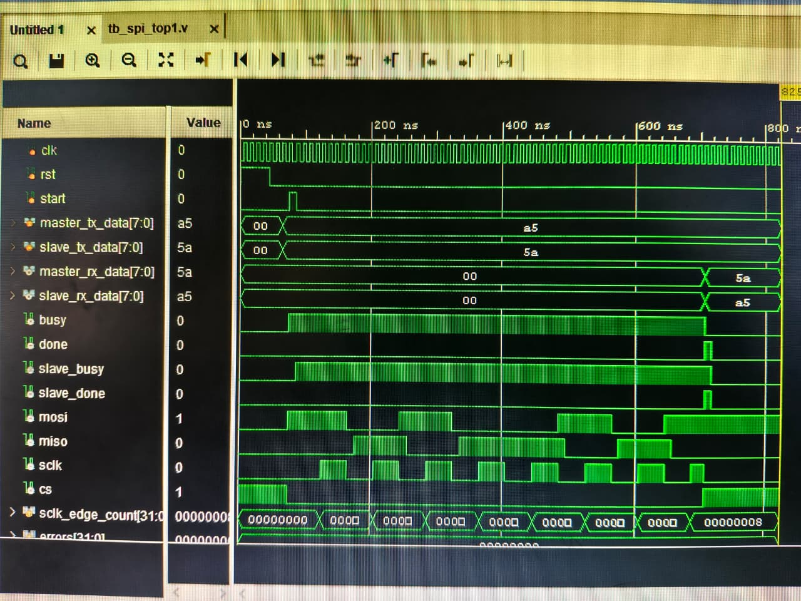

# Waveforms

This folder stores waveform screenshots from Vivado behavioral simulation.

## Status

| Waveform | Description | Status |
|---|---|---|
| `tc01-spi-transaction.jpeg` | CS, SCLK, MOSI, MISO for TC-01 (0xA5 / 0x5A) | ✅ DONE |



## What the Waveform Should Show

```
cs:    ‾‾‾‾‾‾‾\___________________________/‾‾‾‾‾‾‾
sclk:  ________|‾|_|‾|_|‾|_|‾|_|‾|_|‾|_|‾|_______
mosi:  ________1___0___1___0___0___1___0___1_______
miso:  ________0___1___0___1___1___0___1___0_______
done:  _________________________________________|‾|_
```

8 SCLK rising edges between CS assertion and CS deassert.  
MOSI = 10100101 (0xA5, MSB first)  
MISO = 01011010 (0x5A, MSB first)
